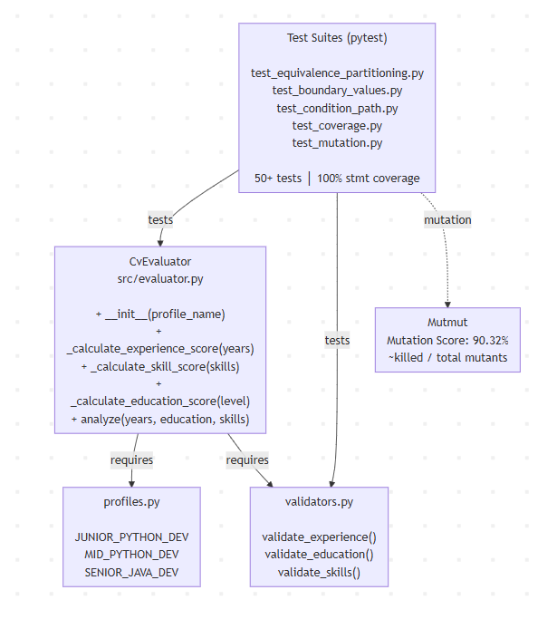
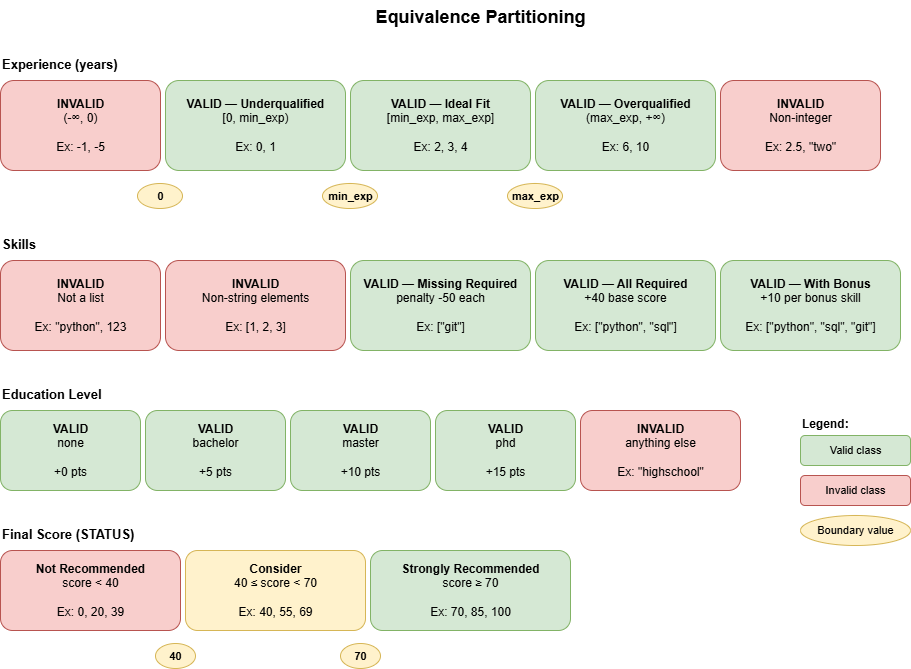
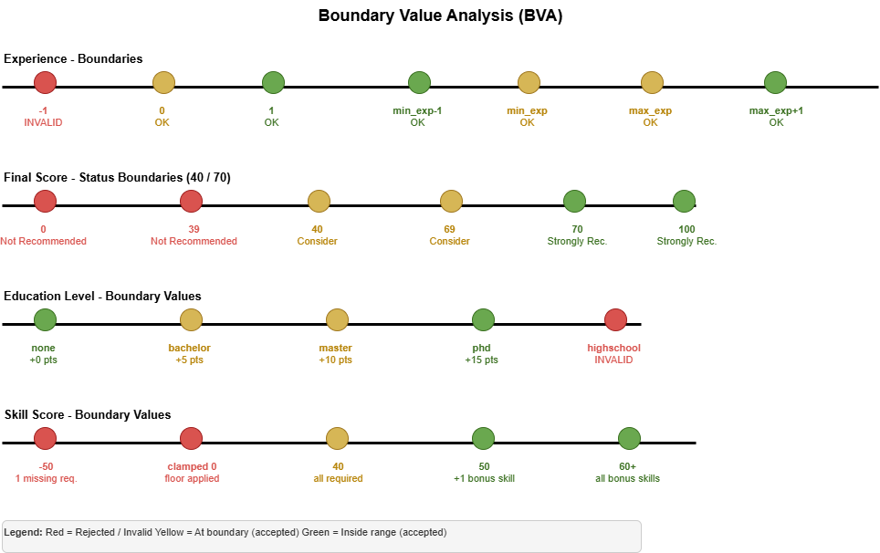
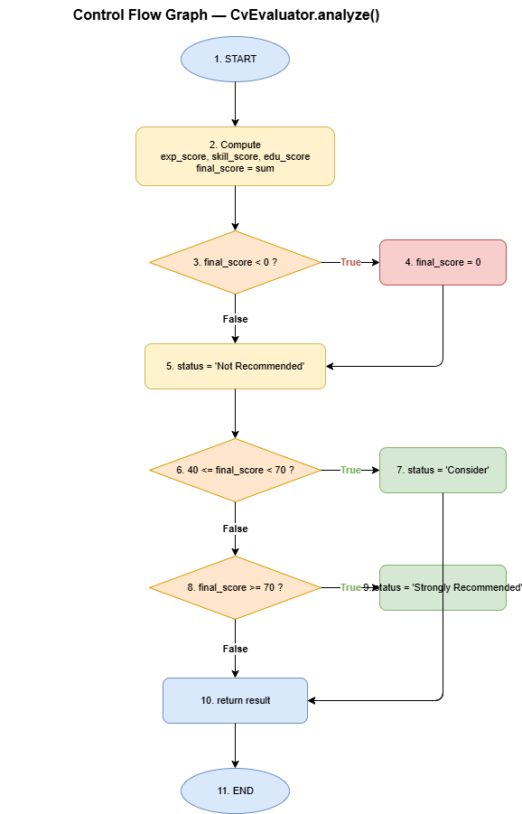

# Software Systems Testing — Team Project

## Topic: T1 — Unit Testing in Python

Project developed as part of the **Software Systems Testing** course, Faculty of Mathematics and Computer Science, 4th year, 2nd semester.

## Team

- Caravan Cosmin
- Stoian Alin
- Vrinceanu Razvan
- Filotie Ionut

## Project Overview

The project consists of implementing and unit testing a **CV evaluation system based on job profiles** in Python, using **pytest** as the testing framework and **mutmut** for mutation testing.

### Class Under Test

**CvEvaluator** (`src/evaluator.py`) evaluates a candidate's CV against a specific job profile and returns a score and recommendation status.

Key method — `analyze`:

```python
def analyze(self, experience_years, education_level, skills):
    exp_score = self._calculate_experience_score(experience_years)
    skill_score = self._calculate_skill_score(skills)
    edu_score = self._calculate_education_score(education_level)

    final_score = exp_score + skill_score + edu_score

    if final_score < 0:
        final_score = 0

    status = "Not Recommended"
    if 40 <= final_score < 70:
        status = "Consider"
    elif final_score >= 70:
        status = "Strongly Recommended"

    return {
        "final_score": final_score,
        "status": status,
        "breakdown": {
            "experience": exp_score,
            "skills": skill_score,
            "education": edu_score
        }
    }
```

### Supporting Modules

**profiles.py** — Job profile definitions:
- `JUNIOR_PYTHON_DEV` — exp: 0–2 years, required: python, sql
- `MID_PYTHON_DEV` — exp: 2–5 years, required: python, sql, git
- `SENIOR_JAVA_DEV` — exp: 5+ years, required: java, spring, sql, kubernetes

**validators.py** — Input validation functions:
- `validate_experience(x)` — must be a non-negative integer
- `validate_education(x)` — must be one of: none, bachelor, master, phd
- `validate_skills(x)` — must be a list of strings

## Diagrams

### System Architecture



### Equivalence Classes



### Boundary Values



### Control Flow Graph — `analyze`



## Testing Strategies

### 1. Equivalence Partitioning

| ID | Domain | Valid Class | Invalid Class |
|----|--------|-------------|---------------|
| EC1–EC2 | Experience | Integer >= 0 | Negative, float, string |
| EC3–EC4 | Education | none, bachelor, master, phd | Any other string |
| EC5–EC6 | Skills | List of strings | Non-list, list with non-strings |
| EC7–EC9 | Final score | < 40, 40–69, >= 70 | — |

File: `tests/test_equivalence_partitioning.py`

### 2. Boundary Value Analysis

| Domain | Below boundary | At boundary | Above boundary |
|--------|---------------|-------------|----------------|
| Experience (min) | -1 (invalid) | 0 (valid) | 1 (valid) |
| Experience (min_exp) | min_exp-1 | min_exp | min_exp+1 |
| Experience (max_exp) | max_exp-1 | max_exp | max_exp+1 |
| Score status | 39 (Not Rec.) | 40 (Consider) | 41 (Consider) |
| Score status | 69 (Consider) | 70 (Strongly) | 71 (Strongly) |

File: `tests/test_boundary_values.py`

### 3. Statement & Branch Coverage

Coverage results:

```text
Name                Stmts   Miss  Cover
---------------------------------------
src/evaluator.py       28      0   100%
src/profiles.py         1      0   100%
src/validators.py       9      0   100%
---------------------------------------
TOTAL                  38      0   100%
```

File: `tests/test_coverage.py`

### 4. Condition & Path Coverage

All compound conditions were tested for every combination of sub-conditions, covering the 4 independent McCabe basis paths (V(G) = 4).

File: `tests/test_condition_path.py`

### 5. Mutation Testing

Tool: **mutmut**

Result: **89.92% mutation score** (116 killed / 129 total)

File: `tests/test_mutation.py`

## Test Results

```
129/129  🎉 116 killed  🙁 13 survived
Mutation Score: 89.92% (116 killed / 129 total)

Name                Stmts   Miss  Cover
---------------------------------------
src/evaluator.py       28      0   100%
src/profiles.py         1      0   100%
src/validators.py       9      0   100%
---------------------------------------
TOTAL                  38      0   100%
```


## Technologies

| Tool | Version | Purpose |
|------|---------|---------|
| Python | 3.x | Programming language |
| pytest | latest | Unit testing framework |
| pytest-cov | latest | Code coverage reporting |
| mutmut | latest | Mutation testing |

## Repository Structure

```
.
├── src/
│   ├── evaluator.py
│   ├── profiles.py
│   └── validators.py
├── tests/
│   ├── test_equivalence_partitioning.py
│   ├── test_boundary_values.py
│   ├── test_coverage.py
│   ├── test_condition_path.py
│   └── test_mutation.py
├── screenshots/
├── requirements.txt
└── README.md
```

## Setup & Usage

```bash
# Install dependencies
pip install -r requirements.txt

# Run tests
pytest

# Run tests with coverage report
pytest --cov=src --cov-report=term-missing

# Run mutation testing
mutmut run
mutmut results
```

## References

- [1] pytest Documentation — <https://docs.pytest.org/>
- [2] mutmut Documentation — <https://mutmut.readthedocs.io/>
- [3] Aniche, M. *Effective Software Testing: A developer's guide*, Simon and Schuster, 2022
- [4] Khorikov, V. *Unit Testing Principles, Practices, and Patterns*, Simon and Schuster, 2020
